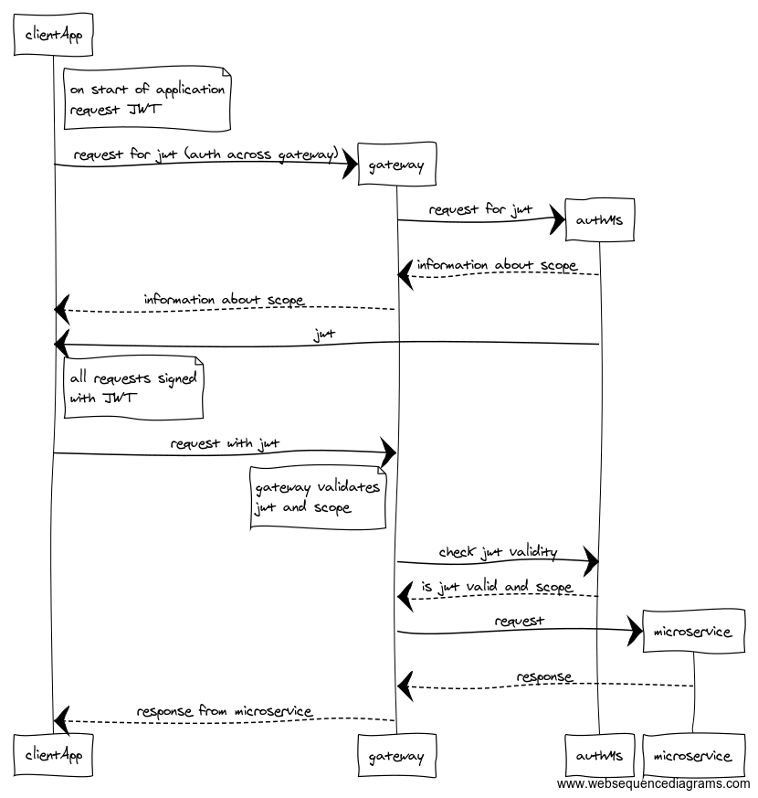

# Auth POC

## Scheme



```
# https://www.websequencediagrams.com/

# client app authorization
clientApp->*authMs: request for jwt
authMs-->clientApp: information about scope

# jwt passed to client via callback to hidden url
authMs->clientApp: jwt

# request with jwt in headers
clientApp->*gateway: request with jwt

# validation jwt via auth-ms
gateway->*authMs: check jwt validity
authMs-->gateway: is jwt valid and scope

# pass request to microservice
gateway->*microservice: request
microservice-->gateway: response

# pass response to client application
=gateway-->clientApp: response from microservice
```

## Prerequirements

1. Install dependencies for all projects
1. Run _auth_

```
cd auth
node index.js
```

3. Run `gateway`

```
cd gateway
yarn start
```

4. Run microservice mock

```
cd api
node src/bin/www
```

## Run commands from `app-client`

1. `cd app-client`
1. Get jwt with `node index.js fetchJWT`
1. Run request with `node index.js requestToApiGateway test`
