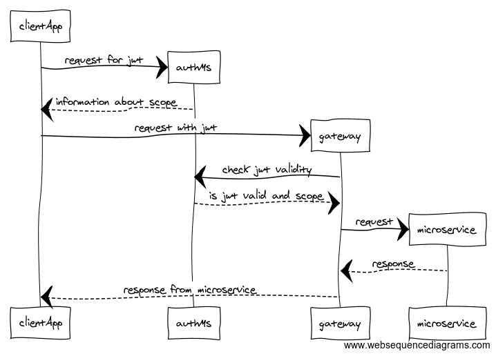

# Auth POC

## Scheme



```
# https://www.websequencediagrams.com/

# client app authorization
note right of clientApp
    on start of application
    request JWT
end note

clientApp->*gateway: request for jwt (auth across gateway)
gateway->*authMs: request for jwt
authMs-->gateway: information about scope
gateway-->clientApp: information about scope

# jwt passed to client via callback to hidden url
authMs->clientApp: jwt

loop during application lifecycle
    # request with jwt in headers
    note right of clientApp
        all requests signed
        with JWT
    end note
    clientApp->*gateway: request with jwt

    # validation jwt via auth-ms
    note left of gateway
        gateway validates
        jwt and scope
    end note
    gateway->*authMs: check jwt validity
    authMs-->gateway: is jwt valid and scope

    # pass request to microservice
    gateway->*microservice: request
    microservice-->gateway: response

    # pass response to client application
    gateway-->clientApp: response from microservice
end
```

## Preliminary requirements

1. Install dependencies for all projects

```
sh install.sh
```

1. Start all instances

```
sh start.sh
```

## Run commands from `app-client`

1. `cd app-client`
1. Get jwt with `node index.js fetchJWT`
1. Run request with `node index.js requestToApiGateway test`
